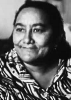

# Memorial Margarida Maria Alves (1933–1983)

<p align="center">
  
</p>

<p align="center">
  <strong>Dossiê Biográfico, Histórico e Pedagógico sobre a Liderança Sindical Camponesa e Heroína da Pátria Brasileira</strong>
</p>

<p align="center">
  <a href="https://github.com/gdvirginio/margarida-maria-alves"></a>
  
  
  
  
  <a href="LICENSE"></a>
</p>

---

## 📌 Sumário

1. [Sobre o Projeto](#-sobre-o-projeto)
2. [Estrutura de Diretórios](#-estrutura-de-diretórios)
3. [Páginas e Módulos de Conteúdo](#-páginas-e-módulos-de-conteúdo)
   - [Página Inicial (index.html)](#1-página-inicial-indexhtml)
   - [Rotas de Direitos Sindicais (routes/)](#2-rotas-de-direitos-sindicais-routes)
4. [Recursos Técnicos e Acessibilidade](#-recursos-técnicos-e-acessibilidade)
5. [Como Visualizar e Executar](#-como-visualizar-e-executar)
6. [Fontes Históricas e Documentais](#-fontes-históricas-e-documentais)
7. [Créditos e Licença](#-créditos-e-licença)

---

## 🌾 Sobre o Projeto

Este projeto é um **memorial histórico digital e interativo** dedicado à vida, liderança e legado de **Margarida Maria Alves** (1933–1983).

Primeira mulher a assumir a presidência do **Sindicato dos Trabalhadores Rurais de Alagoa Grande (PB)**, Margarida liderou a categoria camponesa contra o jugo semifeudal do *cambão*, lutou pelo registro em carteira e enfrentou a violência dos latifundiários do Brejo Paraibano durante o regime militar.

Em 12 de agosto de 1983, foi brutalmente assassinada na porta de sua casa, na frente de seu marido e filho. Seu sacrifício impulsionou:
* A **Marcha das Margaridas**, maior mobilização articulada de mulheres trabalhadoras rurais da América Latina;
* A instituição do **Dia Nacional dos Direitos Humanos** no Brasil em 12 de agosto ([Lei Federal nº 12.641/2012](https://www.planalto.gov.br/ccivil_03/_ato2011-2014/2012/lei/l12641.htm));
* Sua inscrição no **Livro dos Heróis e Heroínas da Pátria** ([Lei Federal nº 14.654/2023](https://www.planalto.gov.br/ccivil_03/_ato2023-2026/2023/lei/l14654.htm)).

---

## 📁 Estrutura de Diretórios

O projeto adota uma arquitetura limpa, estática e modular, separando a página principal, as rotas de aprofundamento temático e os ativos multimídia:

```plaintext
margarida-maria-alves/
│
├── index.html                     # Portal principal: biografia, timeline e acervo
├── style.css                      # Design editorial unificado (Mobile-First, CSS Grid, Flexbox)
├── script.js                      # Interatividade (Drawer mobile, Lightbox acessível e Timeline)
├── README.md                      # Documentação completa do repositório
├── LICENSE                        # Licença de código aberto (MIT)
│
├── assets/                        # Acervo iconográfico histórico
│   ├── marcha_das_margaridas.jpg  # Marcha das Margaridas na Esplanada dos Ministérios
│   ├── margarida_acervo.jpg       # Fotografia histórica preservada em acervos de memória
│   ├── margarida_alves_retrato.png# Retrato oficial recuperado pela Comissão Nacional da Verdade
│   ├── margarida_discurso.jpg     # Discurso histórico de Margarida em comício camponês
│   ├── margarida_flor_fundo.jpg   # Textura visual botânica usada no hero
│   └── museu_casa_margarida.jpg   # Fachada do Museu Casa de Margarida Maria Alves
│
└── routes/                        # Páginas individuais dos Direitos Sindicais
    ├── carteira_assinada.html     # 1. Carteira de Trabalho Assinada e Fim do Cambão
    ├── jornada_8_horas.html       # 2. Jornada de 8 Horas Diárias e Educação no Campo
    ├── decimo_terceiro.html       # 3. 13º Salário no Campo e Rompimento do Endividamento
    ├── ferias_remuneradas.html    # 4. Férias Remuneradas e Proteção na Entressafra
    ├── repouso_semanal.html       # 5. Repouso Semanal Remunerado de 24 Horas
    ├── licenca_maternidade.html   # 6. Licença-Maternidade e Previdência Rural para Mulheres
    └── trabalho_infantil.html     # 7. Erradicação do Trabalho Infantil e Criação do CENTRU
```

---

## 🧭 Páginas e Módulos de Conteúdo

### 1. Página Inicial (`index.html`)
* **Hero Editorial:** Apresentação da homenageada com citação emblemática e síntese de impacto.
* **Biografia Documentada:** Panorama da infância na zona rural, inserção na luta sindical e presidência do STR.
* **Linha do Tempo Interativa:** Marcos cronológicos de 1933 a 2023, sincronizados visualmente via barra de progresso reativa à rolagem (*scroll*).
* **Portal de Conquistas:** Acesso direto às 7 páginas especializadas de direitos trabalhistas.
* **Dossiê Jurídico e Internacional:** Análise detalhada do assassinato e do Relatório de Mérito nº 31/20 da Comissão Interamericana de Direitos Humanos (CIDH/OEA).
* **Acervo Fotográfico:** Galeria com visualizador *Lightbox* e legendas com créditos de fontes institucionais.

### 2. Rotas de Direitos Sindicais (`routes/`)

| Arquivo | Direito Abordado | Fundamentação Histórico-Jurídica |
| :--- | :--- | :--- |
| [`carteira_assinada.html`](routes/carteira_assinada.html) | **Carteira Assinada** | Extinção do cambão, obrigatoriedade da CTPS e aplicação do Estatuto do Trabalhador Rural (Lei 4.214/63). |
| [`jornada_8_horas.html`](routes/jornada_8_horas.html) | **Jornada de 8 Horas** | Superação da jornada extenuante de 12 a 14 horas diárias e tempo para círculos de alfabetização. |
| [`decimo_terceiro.html`](routes/decimo_terceiro.html) | **13º Salário** | Conquista da gratificação natalina contra a exploração dos barracões das usinas açucareiras. |
| [`ferias_remuneradas.html`](routes/ferias_remuneradas.html) | **Férias Remuneradas** | Garantia do descanso anual de 30 dias sem descarte salarial na época da entressafra. |
| [`repouso_semanal.html`](routes/repouso_semanal.html) | **Repouso Semanal** | Descanso de 24h consecutivas contra as escalas contínuas de moagem de domingo a domingo. |
| [`licenca_maternidade.html`](routes/licenca_maternidade.html) | **Maternidade e Previdência** | Sindicalização feminina autônoma, acesso ao Funrural e proteção à maternidade. |
| [`trabalho_infantil.html`](routes/trabalho_infantil.html) | **Fim do Trabalho Infantil** | Retirada de crianças das frentes de corte de cana e criação do CENTRU com a Igreja Progressista. |

---

## 🛠️ Recursos Técnicos e Acessibilidade

* **HTML5 Semântico e Estruturado:**
  * Uso de seções demarcadas (`<header>`, `<main>`, `<article>`, `<nav>`, `<aside>`, `<figure>`).
  * Link direto de salto (`.skip-link`) para leitores de tela e navegação por teclado.
* **CSS3 Moderno:**
  * Paleta de cores em harmonia botânica e histórica (`#225134`, `#12331f`, `#f8faf8`).
  * Variáveis CSS (*Custom Properties*) para rápida manutenção e consistência tipográfica.
  * Layout responsivo (*Mobile-First*) com suporte a **CSS Grid** e **Flexbox**.
  * Barra horizontal de navegação rápida com rolagem suave e centralização dinâmica da aba ativa.
* **JavaScript ES6+ Otimizado:**
  * Uso de `requestAnimationFrame` para performance de rolagem a 60 FPS na linha do tempo.
  * Menu móvel tipo *Drawer* com trava de rolagem no `body`, fechamento por tecla `Escape` e backdrop opaco.
  * Modal Lightbox acessível com foco gerenciado e suporte completo a teclado (`Enter`, `Espaço`, `Esc`).
  * Funções expostas de forma segura no escopo global para garantir compatibilidade com eventos do DOM.
* **Padrões de Acessibilidade (WCAG 2.1 AA):**
  * Contraste de cores rigorosamente adequado para leitura editorial.
  * Atributos ARIA aplicados (`aria-label`, `aria-modal`, `aria-hidden`, `role="dialog"`).
  * Estados `:focus-visible` destacados para quem utiliza navegação sem mouse.

---

## 🚀 Como Visualizar e Executar

O projeto é 100% estático e não requer instalação de pacotes, transpiladores ou banco de dados.

### Execução Direta
Dê dois cliques no arquivo `index.html` ou abra-o em seu navegador de preferência:
```bash
# Linux
xdg-open index.html

# macOS
open index.html

# Windows
start index.html
```

### Servidor Local de Desenvolvimento (Recomendado)
Para uma experiência idêntica à de produção:

* **Com Python 3:**
  ```bash
  python3 -m http.server 8000
  ```
  Acesse no navegador: `http://localhost:8000`

* **Com Node.js (npx):**
  ```bash
  npx serve .
  ```

* **Com VS Code:**
  Abra o diretório no VS Code e clique em **"Go Live"** com a extensão **Live Server**.

---

## 📚 Fontes Históricas e Documentais

Todo o material informativo e cronológico foi consolidado a partir de fontes primárias e secundárias fidedignas:

1. **Comissão Nacional da Verdade (CNV):** *Relatório Final da CNV, Volume III (Mortos e Desaparecidos Políticos)*. Brasília, 2014.
2. **Comissão Interamericana de Direitos Humanos (CIDH/OEA):** *Relatório de Mérito nº 31/20 (Caso 12.332 — Margarida Maria Alves e Familiares vs. Brasil)*, aprovado em abril de 2020.
3. **Comissão Camponesa da Verdade:** *Relatório Final sobre Graves Violações de Direitos Humanos no Campo durante a Ditadura Militar*. DHnet, 2016.
4. **Editora da UFPB:** ROMÃO, Ana Paula de Souza Ferreira. *Margarida, Margaridas: Memória de Margarida Maria Alves (1933–1983) através das Práticas Educativas das Margaridas*. João Pessoa, 2017.
5. **Legislação Federal:**
   * [Lei Federal nº 12.641/2012](https://www.planalto.gov.br/ccivil_03/_ato2011-2014/2012/lei/l12641.htm) — Institui o Dia Nacional dos Direitos Humanos.
   * [Lei Federal nº 14.654/2023](https://www.planalto.gov.br/ccivil_03/_ato2023-2026/2023/lei/l14654.htm) — Inscreve Margarida Maria Alves no Livro dos Heróis e Heroínas da Pátria.
   * [Lei Federal nº 4.214/1963](https://www.planalto.gov.br/ccivil_03/leis/1950-1969/l4214.htm) — Estatuto do Trabalhador Rural.
6. **CONTAG / FETAG-PB:** Acervo documental histórico da Marcha das Margaridas.

---

## 🎓 Créditos e Licença

* **Finalidade:** Projeto educativo desenvolvido para difusão e preservação da memória histórica e cidadã por estudantes da **Etec Dra. Ruth Cardoso** (São Vicente - SP).
* **Mantenedor / Autor do Repositório:** [@gdvirginio](https://github.com/gdvirginio)
* **Licença:** Este projeto está sob a licença **MIT**. Consulte o arquivo [LICENSE](LICENSE) para obter mais informações.

---

<p align="center">
  <em>"Da luta não fujo. É melhor morrer na luta do que morrer de fome."</em><br>
  <strong>— Margarida Maria Alves (1933–1983)</strong>
</p>
